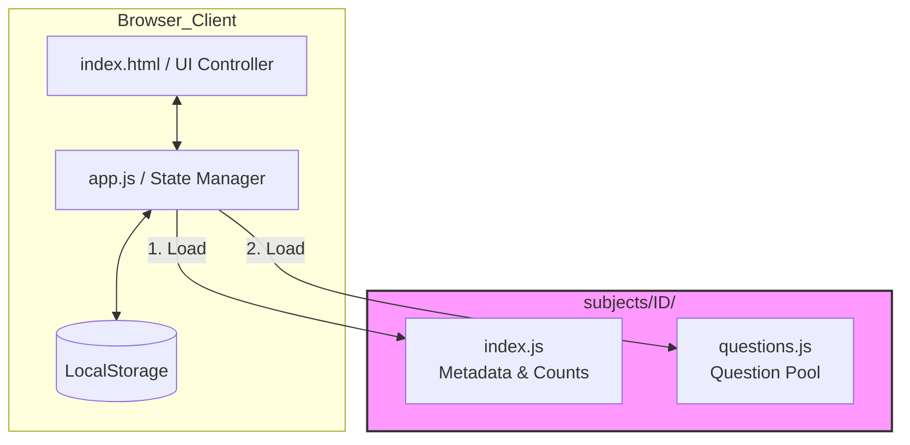
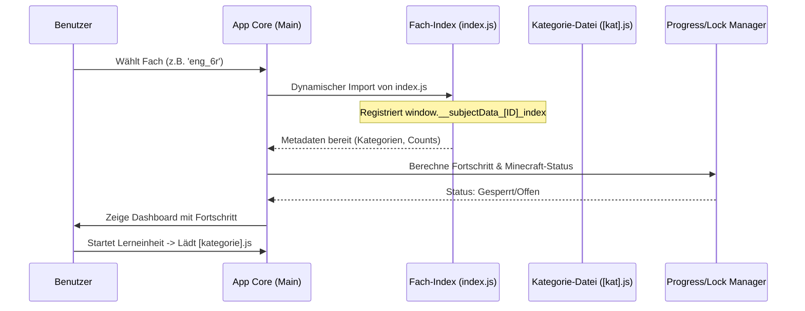

# Dokumentation: Multi-Subject Master

## 1. Anwendungsbeschreibung
Der **Multi-Subject Master** ist eine adaptive Lern-Anwendung, die speziell für Schüler in Bayern (6./7. Klasse Realschule und 8./9. Klasse Gymnasium) entwickelt wurde. Die App ermöglicht das Üben von Lehrplaninhalten durch ein interaktives Quiz-System mit aktuell **6.239 Fragen in 28 Fächern**.

Kernaspekte der Anwendung sind:
- **Adaptivität:** Ein "Smart Mode" passt die Fragenhäufigkeit an den Lernerfolg des Nutzers an.
- **Gamification:** Belohnungssysteme durch Badges, Streak-Counter und ein spezielles Minecraft-Unlock-System.
- **Breites Wissen:** Ein klassenstufenunabhängiger Bereich "Allgemeinwissen" ergänzt die schulischen Inhalte.
- **Persistenz:** Lokale Speicherung aller Fortschritte ohne Notwendigkeit einer Datenbank-Anbindung.

## 2. Grobarchitektur

Die Anwendung folgt einem modularen **Single-Page-Application (SPA)** Ansatz, der vollständig im Browser läuft.

### Fächerbaum (28 Fächer, 6.239 Fragen)

```
📚 LernApp
├── 6r (1.478 Fr.) ─── eng_6r · math_6r · de_6r · hist_6r · geo_6r · mc
├── 7r (1.519 Fr.) ─── eng_7r · math_7r · de_7r · hist_7r · geo_7r · phys_7r · bio_7r
├── 8g  (984 Fr.) ─── phys_8g · eng_8g · math_8g · bio_8g · lat_8g
├── 9g (2.143 Fr.) ─── eng_9g · math_9g · de_9g · phys_9g · bio_9g · chem_9g · hist_9g · geo_9g · lat_9g
└── aw  (115 Fr.) ─── welt · natur · kultur · technik
```

### Komponenten-Struktur
- **Präsentationsschicht (UI):** Gesteuert über `index.html` und CSS-Variablen für themenspezifisches Design.
- **Logik-Kern (`app.js`):** Verwaltet den globalen `state`, das Event-Handling und die Quiz-Algorithmen.
- **Datenkataloge (`subjects/`):** Jedes Fach ist als Modul in einem eigenen Verzeichnis organisiert (Lazy Loading von Metadaten und Inhalten).
- **Speicherschicht:** Nutzung der Web Storage API (`localStorage`) zur Persistierung des Nutzerfortschritts.

### Dateistruktur der Fach-Module
Jedes Fachverzeichnis (z. B. `subjects/eng_6r/`) folgt einer strikten Struktur (Kurzform = Key = Path):

| Datei | Beschreibung | Rolle in der Logik |
| :--- | :--- | :--- |
| `index.js` | Definiert Metadaten, Kategorien und `questionCounts`. | Basis für Fortschrittsberechnung und UI-Initialisierung. |
| `[kategorie].js` | Enthält den Fragen-Pool einer Kategorie als Array. | Datenbasis für das Quiz-System. |

### Architektur-Diagramm



## 3. Innerer Workflow

Der zentrale Workflow der Anwendung ist der Quiz-Zyklus, der die Auswahl, Präsentation und Auswertung von Fragen steuert.

### Technische Lade-Sequenz
Die App nutzt ein modulares Ladesystem (Lazy Loading), um die Initiallast gering zu halten.



### Quiz-Workflow


### Datenfluss beim Speichern
1.  **Ergebniserfassung:** Bei jeder Antwort wird das `questionStats`-Objekt im aktuellen `state` aktualisiert.
2.  **Synchronisation:** Die Funktion `syncStatsFromData()` stellt sicher, dass die Statistiken in die Fach-Struktur übertragen werden.
3.  **Persistierung:** `saveState()` konvertiert das State-Objekt in einen JSON-String und speichert es unter einem fachspezifischen Key (z.B. `lernapp_math_8g`) im `localStorage`.

## 4. Features im Detail
- **Smart Mode:** Dynamische Schwierigkeitsanpassung pro Frage basierend auf dem letzten Ergebnis:
  - `difficulty` wird nach jeder Antwort angepasst: richtig → −0.5, falsch → +0.5 (Bereich 0.0–2.0)
  - Gewichtung: sehr leicht (≤0.0)→1, leicht (≤0.5)→3, mittel (≤1.0)→6, schwer (≤1.5)→10, sehr schwer (>1.5)→15
  - **Anti-Demotivation:** Nach einer schweren Frage werden leichte Fragen 3× höher gewichtet, schwere nur halb so oft
  - Ermöglicht eine ausgewogene Abfrage: schwere Fragen öfter, leichte seltener aber regelmäßig zur Motivationserhaltung
- **Minecraft-Belohnung:** Ein spezielles Belohnungssystem für die Unterstufe.
    - **Logik:** Die App summiert die `questionCounts` aus der `index.js`. Der Fortschritt wird gegen die im `localStorage` als korrekt markierten IDs geprüft.
    - **Trigger:** Bei Erreichen definierter Schwellenwerte (z.B. 100% einer Kategorie oder des Fachs) werden Bonus-Inhalte freigeschaltet.
    
    #### Fehlerbehebung Freischaltung:
    Falls Fragen nicht freigeschaltet werden, folgende Punkte prüfen:
    1. **Namenskonvention:** Globaler Namespace muss `window.__subjectData_[FachID]_index` entsprechen.
    2. **Konsistenz:** Die Summe in `questionCounts` muss exakt der Anzahl der Objekte in den Kategorie-Dateien entsprechen.
    3. **Kategorie-Keys:** Keys in `categories` müssen identisch mit denen in `questionCounts` sein.

    #### Validierung:
    Zur Prüfung der Konsistenz kann folgender PowerShell-Befehl genutzt werden:
    ```powershell
    # Zählt Fragen in allen Kategorie-Dateien und vergleicht mit index.js
    Get-ChildItem subjects/*/ -Directory | ForEach-Object { $d=$_.FullName; $idx=Get-Content "$d\index.js" -Raw; $m=[regex]::Match($idx,'questionCounts":\{([^}]+)\}'); if($m.Success){$c=@{};$m.Groups[1].Value-split','|%{$p=$_-split':'|%{$_.Trim().Trim('"')};if($p.Count-eq2){$c[$p[0]]=[int]$p[1]}};Get-ChildItem $d -Filter *.js|?{$_.Name-ne'index.js'}|%{$n=[regex]::Matches(($_|Get-Content -Raw),'"?question"?\s*:','Singleline').Count;$e=$c[$_.BaseName];if($e-ne$null-and$n-ne$e){Write-Warning "$($_.Directory.Name)/$($_.BaseName): $n vs $e"}}} }
    ```

- **Multi-Grade-Support:** Trennung der Logik und UI-Filter für Realschule (6r, 7r) und Gymnasium (8g, 9g) sowie Allgemeinwissen (aw).
- **Textaufgaben-Mastery:** Ein dediziertes System zur Förderung der Lesekompetenz in MINT-Fächern. Es nutzt spezialisierte Sub-Modi:
    - *Text Surgeon:* Filtert "Rauschen" (irrelevante Story-Infos) aus Aufgaben.
    - *Question Hunter:* Trainiert das Erkennen der Zielsetzung.
    - *Info Jigsaw:* Schult das logische Kombinieren von Fakten.
    - *Units Detective:* Verhindert typische Einheiten-Fehler.
    - *Question Clarity:* Übersetzt natürliche Sprache in mathematische Logik.


---
*Erstellt von Gemini Code Assist*