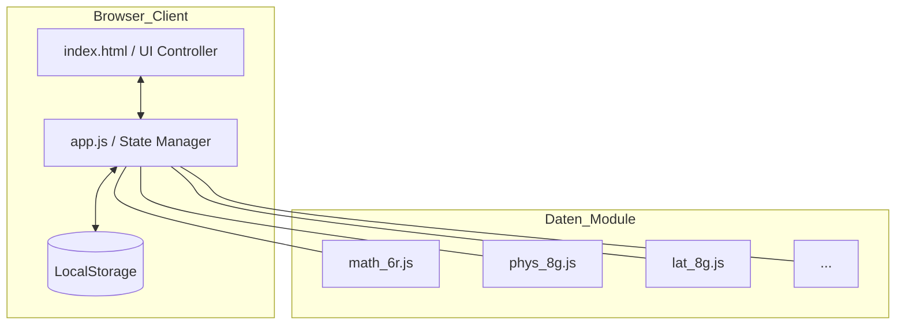
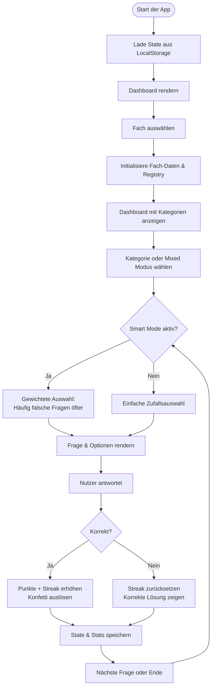

# Dokumentation: Multi-Subject Master

## 1. Anwendungsbeschreibung
Der **Multi-Subject Master** ist eine adaptive Lern-Anwendung, die speziell für Schüler in Bayern (6. Klasse Realschule und 8. Klasse Gymnasium) entwickelt wurde. Die App ermöglicht das Üben von Lehrplaninhalten durch ein interaktives Quiz-System.

Kernaspekte der Anwendung sind:
- **Adaptivität:** Ein "Smart Mode" passt die Fragenhäufigkeit an den Lernerfolg des Nutzers an.
- **Gamification:** Belohnungssysteme durch Badges, Streak-Counter und ein spezielles Minecraft-Unlock-System für jüngere Schüler.
- **Persistenz:** Lokale Speicherung aller Fortschritte ohne Notwendigkeit einer Datenbank-Anbindung.

## 2. Grobarchitektur

Die Anwendung folgt einem modularen **Single-Page-Application (SPA)** Ansatz, der vollständig im Browser läuft.

### Komponenten-Struktur
- **Präsentationsschicht (UI):** Gesteuert über `index.html` und CSS-Variablen für themenspezifisches Design.
- **Logik-Kern (`app.js`):** Verwaltet den globalen `state`, das Event-Handling und die Quiz-Algorithmen.
- **Datenkataloge (`subjects/`):** Jedes Fach ist in einer separaten JavaScript-Datei gekapselt, die das Fragen-Pool-Objekt (`subjectData`) bereitstellt.
- **Speicherschicht:** Nutzung der Web Storage API (`localStorage`) zur Persistierung des Nutzerfortschritts.

### Architektur-Diagramm

## 3. Innerer Workflow

Der zentrale Workflow der Anwendung ist der Quiz-Zyklus, der die Auswahl, Präsentation und Auswertung von Fragen steuert.

### Quiz-Workflow

### Datenfluss beim Speichern
1.  **Ergebniserfassung:** Bei jeder Antwort wird das `questionStats`-Objekt im aktuellen `state` aktualisiert.
2.  **Synchronisation:** Die Funktion `syncStatsFromData()` stellt sicher, dass die Statistiken in die Fach-Struktur übertragen werden.
3.  **Persistierung:** `saveState()` konvertiert das State-Objekt in einen JSON-String und speichert es unter einem fachspezifischen Key (z.B. `lernapp_math_8g`) im `localStorage`.

## 4. Features im Detail
- **Smart Mode:** Nutzt eine Gewichtungslogik (Gewicht 20 bei Rate < 50%, Gewicht 2 bei Rate > 80%), um ineffizientes Lernen zu vermeiden.
- **Minecraft-Belohnung:** Ein fächerübergreifender Zähler schaltet im Verhältnis 10:1 neue Fragen im Minecraft-Katalog frei.
- **Multi-Grade-Support:** Trennung der Logik und UI-Filter für Realschule (6r) und Gymnasium (8g).

---
*Erstellt von Gemini Code Assist*